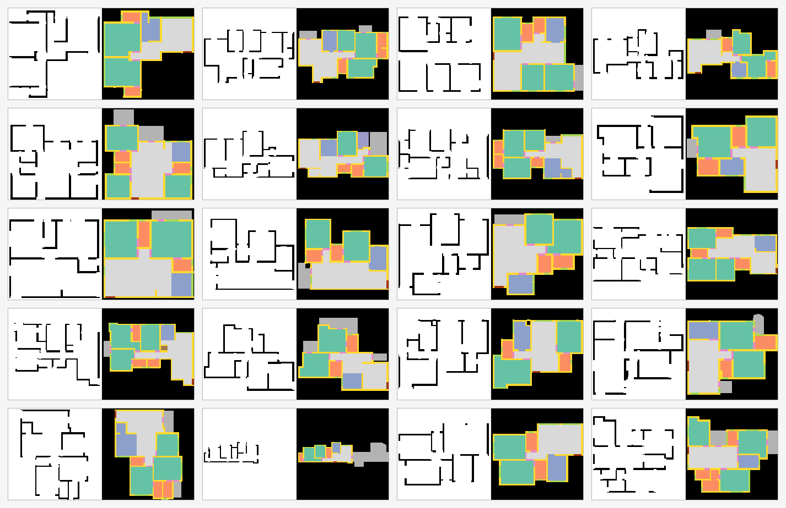

# ResPlan → пары для семантической сегментации

Пайплайн, который превращает векторный датасет планировок **ResPlan** (17 000
жилых планов в виде Shapely-геометрий) в готовые для обучения **пары
«изображение → маска»**.

На выходе:

| | |
|---|---|
| **вход** | чертёж плана: тёмные стены на белом листе, двери и окна — разрывы в стенах |
| **метка** | одноканальная PNG-маска, значение пикселя = ID класса (0 = фон) |

Комнаты на входе **намеренно не раскрашены по типам** — иначе задача вырождается
и модель считывает цвет вместо того, чтобы учить геометрию.



Вход и маска рендерятся через **одну и ту же** геометрическую трансформацию
(`plan_transform`), поэтому совпадают попиксельно по построению, а не по
совпадению. Проверено на 300 случайных парах: доля тёмных пикселей входа,
попавших в класс `wall` маски — **1.0000** (минимум по выборке тоже 1.0000).

---

## Быстрый старт

```bash
git clone https://github.com/VelmorSdfg/ResPlan_Dataset.git
```

```bash
pip install shapely numpy opencv-python-headless
```

### 1. Получить данные

Датасет в репозиторий не входит (сотни МБ). Скачайте `ResPlan.zip` из
первоисточника и положите в корень проекта:

* GitHub: <https://github.com/m-agour/ResPlan>
* Kaggle: <https://www.kaggle.com/datasets/resplan/resplan>

Распаковывать вручную не нужно — но если хотите, скрипт ждёт `ResPlan.pkl`
в корне:

```bash
python -c "import zipfile; zipfile.ZipFile('ResPlan.zip').extractall('.')"
```

### 2. Сгенерировать пары

```bash
python resplan_to_masks.py --res 256 --val-frac 0.15 --images
```

Полный прогон 17 000 планов занимает несколько минут и создаёт `masks_out/`.

### Полезные флаги

| флаг | по умолчанию | что делает |
|---|---|---|
| `--res` | `256` | сторона квадратной маски в пикселях |
| `--images` | выкл. | рендерить входные чертежи (без него будут только маски) |
| `--color` | выкл. | дополнительно писать цветные превью масок для глазной проверки |
| `--val-frac` | `0.15` | доля валидации |
| `--seed` | `42` | зерно сплита (сплит детерминирован по хэшу id) |
| `--limit` | `0` | обработать только N планов — для быстрой пробы |
| `--margin` | `4` | отступ от края холста, px |
| `--opening-dilate` | `1` | насколько расширять двери/окна при вырезании проёма в стене |

Пробный прогон на 20 планах с превью:

```bash
python resplan_to_masks.py --limit 20 --images --color
```

---

## Структура папок

```
.
├── resplan_to_masks.py      # основной скрипт: PKL → пары image/mask + сплиты
├── resplan_utils.py         # утилиты авторов ResPlan (растеризация, геометрия)
├── ResPlan_demo.ipynb       # демо-ноутбук авторов ResPlan
├── assets/                  # картинки для README и визуальные проверки
├── ResPlan.zip              # ← скачивается вручную, НЕ в репозитории
├── ResPlan.pkl              # ← распаковывается из zip, НЕ в репозитории
└── masks_out/               # ← генерируется скриптом, НЕ в репозитории
    ├── images/{id}.png      #   вход: чертёж (uint8, 0 = стена, 255 = лист)
    ├── masks/{id}.png       #   метка: uint8, значение пикселя = ID класса
    ├── train.txt / val.txt  #   сплиты (детерминированы по --seed)
    ├── class_mapping.json   #   ✓ в репозитории
    └── pixel_frequency.json #   ✓ в репозитории
```

`class_mapping.json` и `pixel_frequency.json` закоммичены намеренно: они
маленькие, но фиксируют таксономию и статистику, под которые обучалась модель.
Сами данные и сплиты воспроизводятся запуском скрипта.

---

## Таксономия классов

Маппинг вынесен в словарь `CLASS_ID` в начале `resplan_to_masks.py` и **не
захардкожен по коду** — чтобы таксономию можно было согласовать с внешней
схемой. Чтобы слить классы, дайте двум исходным ключам один ID; чтобы
исключить класс — уберите ключ из словаря.

| ID | класс | доля пикселей | планов с классом |
|---:|---|---:|---:|
| 0 | background | 43.30 % | — |
| 1 | living | 16.83 % | 100 % |
| 2 | bedroom | 17.66 % | 100 % |
| 3 | bathroom | 4.27 % | 100 % |
| 4 | kitchen | 4.51 % | 99.3 % |
| 5 | balcony | 3.16 % | 76.9 % |
| 6 | storage | 0.15 % | 10.5 % |
| 7 | stair | 0.10 % | 4.0 % |
| 8 | wall | 7.77 % | 100 % |
| 9 | window | 1.26 % | 99.7 % |
| 10 | door | 0.82 % | 100 % |
| 11 | front_door | 0.17 % | 100 % |

Слои `inner`, `land`, `garden`, `parking`, `pool` в исходных данных есть, но в
таксономию **не включены**: это контекст участка (парцелла, сад, парковка), а не
помещения. При необходимости добавляются одной строкой в `CLASS_ID`.

### Порядок отрисовки

`DRAW_ORDER` задаёт, кто рисуется поверх кого: сначала помещения, затем тонкие
архитектурные элементы (`wall`, `window`, `door`, `front_door`). Иначе стены
«тонут» под заливкой комнат.

---

## Особенности данных, которые влияют на обучение

**Сильный дисбаланс классов.** `bedroom` + `living` — около трети пикселей,
против `stair` 0.10 % и `storage` 0.15 %. Разрыв примерно 200×. Готовые доли
лежат в `pixel_frequency.json` — их можно подать прямо в расчёт весов
CrossEntropy или в Tversky для тонких классов (`wall`, `window`, `door`).

**У балкона почти нет признаков на входе.** Балконы в ResPlan не огорожены
стенами, поэтому на чертеже на их месте чистый лист. Доля границы помещения,
подпёртая стеной на входе:

| класс | граница со стеной |
|---|---:|
| storage | 86 % |
| bathroom | 83 % |
| bedroom | 79 % |
| kitchen | 76 % |
| living | 76 % |
| stair | 56 % |
| **balcony** | **28 %** |

То есть у `balcony` в ~72 % периметра визуальных признаков нет — модель будет
угадывать его по положению «снаружи основного объёма». Систематически низкий IoU
по этому классу здесь ожидаемый результат, а не ошибка обучения. Если класс
важен, стоит подмешать во вход контур `balcony` или `inner` отдельным каналом.

**Координаты выходят за пределы холста.** Поле `inner` всегда лежит в `[0, 256]`,
но сами слои комнат и стен выходят за рамку (до −172…502 по X). Поэтому
вписывание считается по bounding box **всех рисуемых слоёв**, а не по `inner` —
иначе балконы и наружные стены обрезались бы.

**Мелочи целостности.** У одного плана `living = None`, у другого `window = None`
— пустые слои скрипт пропускает.

---

## Источник данных и лицензия

Датасет и файлы `resplan_utils.py` / `ResPlan_demo.ipynb` — работа авторов
**ResPlan**: <https://github.com/m-agour/ResPlan>, лицензия MIT (см. `LICENSE`).
Этот репозиторий добавляет к ним пайплайн подготовки пар для сегментации.
